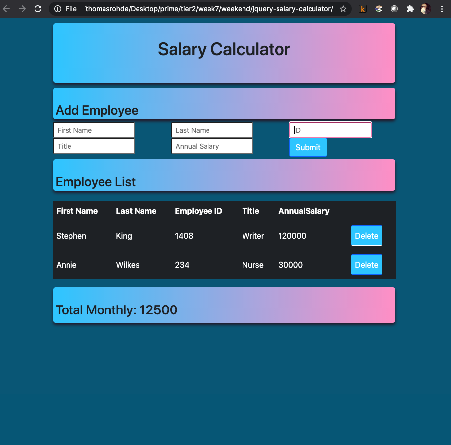
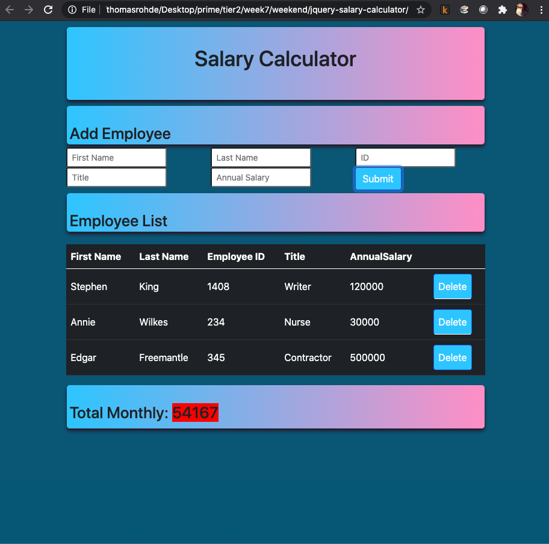

# Project Name

[Project Instructions](./INSTRUCTIONS.md), this line may be removed once you have updated the README.md

## Description

Your project description goes here. What problem did you solve? How did you solve it?

Additional README details can be found [here](https://github.com/PrimeAcademy/readme-template/blob/master/README.md).

# SALARY CALCULATOR

## Description

_Duration: 48 Hours_

This is a Salary Calculator class project completed during a weekend project sprint. The base functionality of the calculator allows employee inputs for First Name, Last Name, Job Title, Employee ID, and Annual Salary. These inputs are added to a table, and as they are added, the annual salaries are calculated out to display the total monthly costs associated with the employees below the table. If the costs are larger than a particular threshold (in this case, $20000 for the month) then the total monthly cost displayed will be highlighted red to draw attention to it.

To see the fully functional site, please visit: [DEPLOYED VERSION OF APP](www.heroku.com)

## Screen Shot

### Prerequisites

## Installation

No installation necessary.

## Usage
How does someone use this application? Tell a user story here.

1. go to web application
2. Enter employee information in applicable fields
3. Click Submit button
4. See the employee added to the table & the monthly cost for the employee entered into the Total Monthly field at the bottom.
5. Use Delete button to remove employee line from table
6. Note the Total Monthly Costs, if it is above $20000 the total will be highlighted in red.

## Built With

- html
- css
- javascript
- jquery
- bootstrap

## Acknowledgement
Thanks to [Prime Digital Academy](www.primeacademy.io) who equipped and helped me to make this application a reality. Thank you Zhu for the help and the conversation during the weekend study groups in the zoomroom.

## Support
If you have suggestions or issues, please email me at [trohde@rocketmail.com]